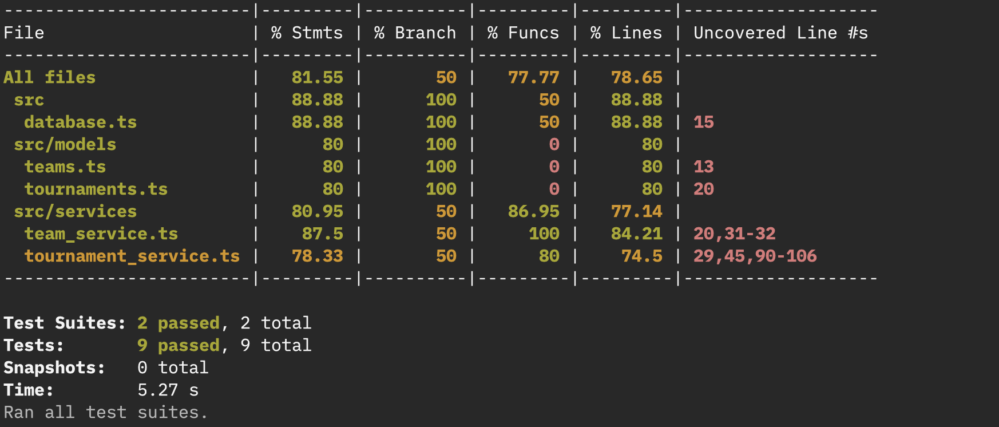
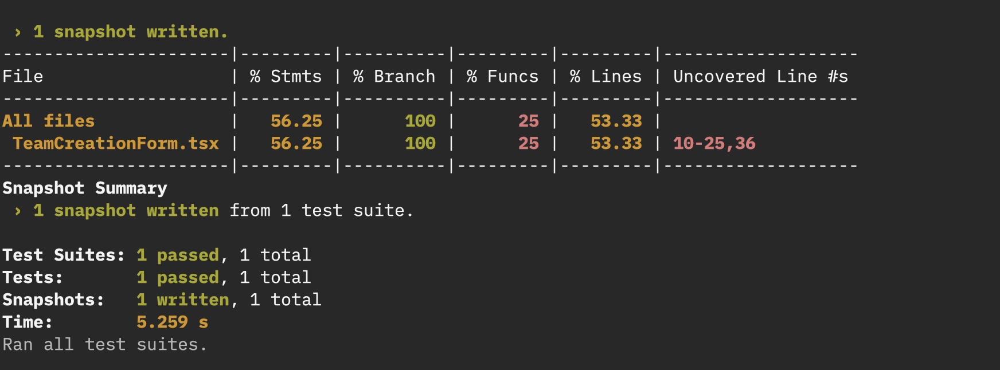

# Basketball App (CS482-Software Engineering Group Project)

## Run Instructions
1. Go to both `client/` and `server/` folders and run `npm i` in each

### Backend
1. Go to `server/`
2. `npm run tsc`
3. `npm run start`

### Frontend
1. Go to `client/`
2. `npm run build`
3. `npm run dev`

## Test Coverage Reports

### Backend

### Frontend

